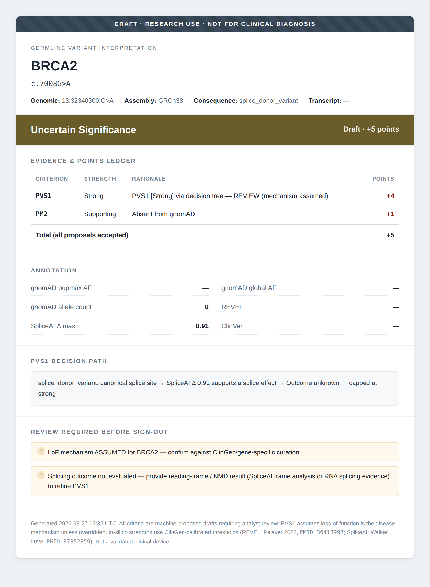

# Clinical Genomics Interpretation Engine

> Turning annotated DNA/RNA variants into ACMG/AMP-classified, report-ready calls — a multi-modal germline + somatic interpretation engine, validated for concordance against ClinVar with a zero contradiction rate.

---

## Why This Project

Interpreting variants is where a diagnostic genomics workflow gets genuinely challenging. I built an end-to-end interpretation engine that takes an annotated VCF and applies the ACMG/AMP framework consistently, with every piece of evidence traceable for clinical review. It proposes ClinGen-calibrated ACMG criteria, works through the PVS1 decision tree, incorporates RNA functional evidence, and classifies both germline variants using points-based ACMG and somatic variants using AMP/ASCO/CAP tiers. The pipeline then generates a clinical report and benchmarks its classifications against ClinVar. 62 tests, all CI-checked.

---

## Key Results

### ClinVar concordance benchmark
Scored the engine against expert-reviewed ClinVar classifications, reporting a mismatch *taxonomy* rather than a naive accuracy number:

| Metric | Result | What it means |
|---|---|---|
| **Contradiction rate** | **0%** | Engine never called the opposite direction to expert consensus |
| Clinical concordance | direction-level agreement (P↔LP, B↔LB) | actionable-call agreement |
| Mismatch taxonomy | undercall / overcall / **contradiction** | disagreements sorted by *type*, not just counted |

Every disagreement was a **conservative undercall** (engine → VUS where evidence from a VCF row alone was insufficient), never a contradiction, the safety property a clinical pipeline needs.

### Engine capabilities
- **Points-based ACMG germline** - ClinGen/Tavtigian framework (VS 8 / S 4 / M 2 / Sup 1); P ≥10, LP 6–9, VUS 0–5, LB −1…−6, B ≤−7; BA1 override; conflict flagging.
- **PVS1 decision tree** (Abou Tayoun 2018) - strength by NMD + region criticality, never Very Strong without an NMD determination.
- **RNA-as-evidence** - FRASER splicing / OUTRIDER expression / ASE / fusions → PS3/BS3 and the PVS1 splice branch.
- **Somatic tiering** - AMP/ASCO/CAP 2017 four-tier + OncoKB level mapping.
- **Calibrated in-silico thresholds** - REVEL (Pejaver 2022, PMID 36413997), SpliceAI (Walker 2023, PMID 37352859); single PP3, double-count guard.

---

## Example Output

From one annotated VCF row → proposed criteria → PVS1 tree → points → clinical report:



```text
BRCA2  c.7008G>A   splice_donor_variant
   PM2  [Supporting]   Absent from gnomAD
   PVS1 [Strong]       via decision tree — REVIEW (mechanism assumed)
   FLAG: splicing outcome not evaluated — provide NMD/frame result to refine PVS1
   => DRAFT: Uncertain Significance (+5)     # capped, not overcalled
```

The engine **refuses to overcall**: a truncating variant stays VUS until NMD is confirmed, and names exactly what evidence closes the gap — which the RNA layer supplies.

---

## Architecture

```
 Orchestration (external)   Nextflow/Snakemake · GATK/DeepVariant · DROP (FRASER/OUTRIDER)
            |
 Annotation (adapters)      VEP · gnomAD · ClinVar · SpliceAI · REVEL  ->  features on GenomicVariant
            |
 INTERPRETATION ENGINE      core/      GenomicVariant, Evidence, CriterionCall
   (this repo)              germline/  ACMG criteria, points classifier, PVS1 tree
                            rna/       RNA observations -> ACMG calls
                            somatic/   AMP/ASCO/CAP tiers + OncoKB
                            annotation/ VCF reader + proposer (propose-then-review)
                            benchmark/ ClinVar concordance harness
            |
 Report                     report/    standalone HTML clinical report
```

**Core design decision:** raw `Evidence` is separated from an interpreted `CriterionCall`, so any criterion can fire at a modulated strength — exactly what functional/RNA data needs.

---

## Methods

**1. Germline classification** - ACMG/AMP criteria applied at modulated strengths and summed on the ClinGen/Tavtigian point scale to a 5-tier call.

**2. PVS1 refinement** - Abou Tayoun (2018) decision tree gating loss-of-function strength on NMD prediction, biologically-relevant transcript, and region criticality.

**3. In-silico evidence** - REVEL (missense) and SpliceAI (splice) mapped to PP3/BP4 at ClinGen-calibrated thresholds, PP3 counted once at the strongest applicable strength, suppressed where PVS1 already owns the splice signal.

**4. Somatic tiering** - AMP/ASCO/CAP 2017 four-tier by clinical actionability, with OncoKB level → evidence-level mapping, kept separate from germline logic.

**5. Validation** - engine output compared to ClinVar CLNSIG (filtered by review-star level), scored as a confusion matrix + mismatch taxonomy.

---

## Reproducing This

```bash
git clone https://github.com/Agni-18/clingenomics
cd clingenomics
pip install -r requirements.txt

python -m pytest -q                       # 62 tests
python -m clingenomics.report.demo        # HTML reports from sample VCF
python -m clingenomics.benchmark.demo     # ClinVar concordance benchmark
```

Run on your own annotated VCF (INFO tags configurable):
```python
from clingenomics.annotation.vcf import read_vcf, VcfFieldMap
from clingenomics.report.html_report import build_report_for, write_report
for v, f in read_vcf("your.vcf", field_map=VcfFieldMap(gnomad_popmax_af="AF_grpmax")):
    write_report(f"reports/{v.gene_symbol}.html", build_report_for(v, f))
```

---

## Repository Structure

```
clingenomics/
├── core/         GenomicVariant, Evidence, CriterionCall, Strength
├── germline/     ACMG criteria registry, points classifier, PVS1 tree
├── rna/          RNA observations -> ACMG criterion calls
├── somatic/      AMP/ASCO/CAP 2017 tiers + OncoKB mapping
├── annotation/   VCF reader, feature model + thresholds, proposer
├── benchmark/    ClinVar concordance harness
└── report/       standalone HTML clinical report
tests/            62 tests
data/             synthetic sample + benchmark VCFs
```

---

## Tools & Libraries

| Library | Purpose |
|---|---|
| Python 3.10+ | core implementation |
| Pydantic v2 | typed, validated domain models |
| pytest | 62-test suite |
| GitHub Actions | CI across Python 3.10 / 3.11 / 3.12 |

Pure-Python VCF reader (no cyvcf2/pysam) - installs anywhere, drops onto an existing annotation stack.

---

## References

Richards 2015 (ACMG/AMP) · Tavtigian 2018/2020 (points framework) · Abou Tayoun 2018 (PVS1) · Pejaver 2022 (PMID 36413997) · Walker 2023 (PMID 37352859) · Li 2017 (AMP/ASCO/CAP).

---

## Author

**Agnidipa**
M.Tech Bioinformatics · Delhi Technological University

[LinkedIn](https://www.linkedin.com/in/agnidipa-sett-6aa896323/) · [GitHub](https://github.com/Agni-18)